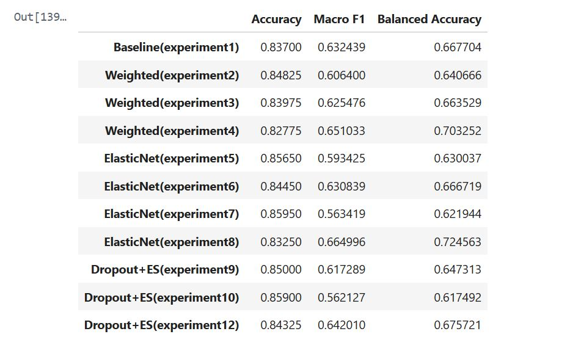

# credit-risk-classification-neural-network
This project builds a deep learning model to classify individuals into financial risk categories (Low, Medium, High) based on demographic and financial features.

## 📈 Model Performance

## ⚠️ Key Challenge

The dataset exhibited class imbalance (low-risk bias), making accuracy misleading. To address this, we used:

- Macro F1 Score
- Balanced Accuracy

## 📊 Results

- Achieved strong classification performance across all classes  
- Improved minority class detection using balanced metrics  
 
